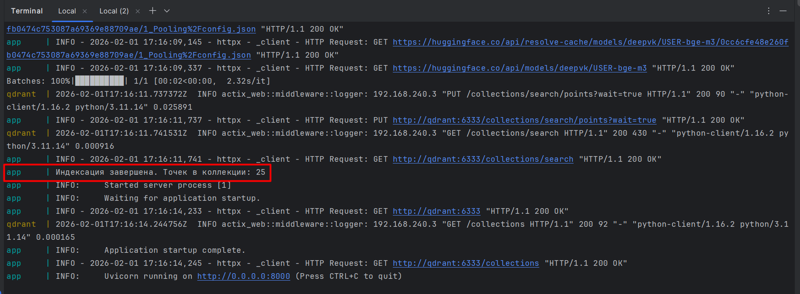
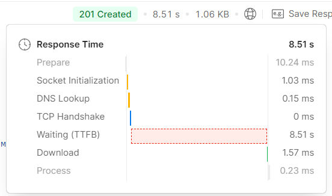
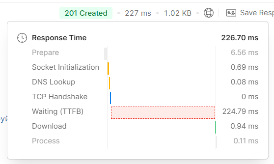
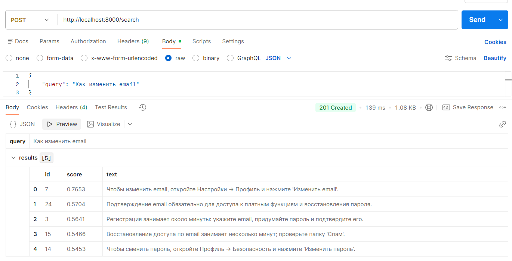
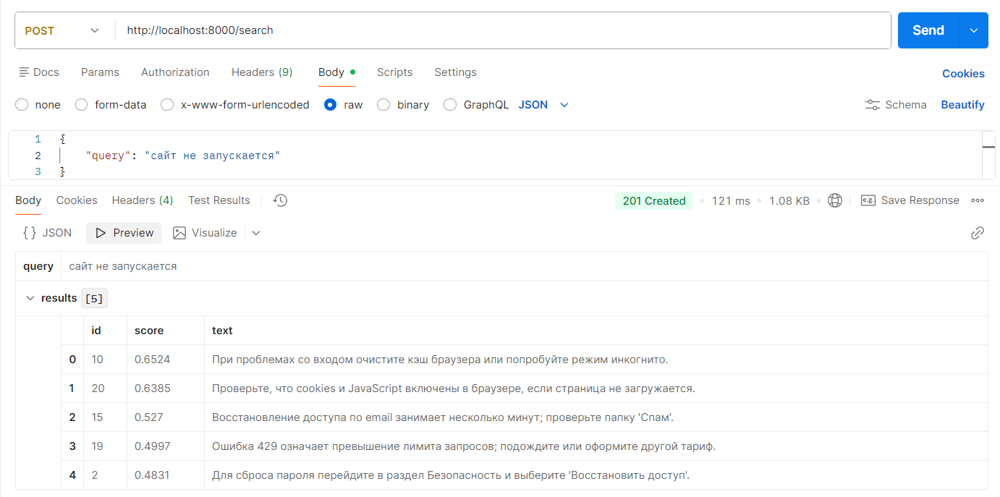

# Мини-сервис семантического поиска

API на Python + Litestar для семантического поиска по данным. Векторная БД — Qdrant, эмбеддинги — локальная модель USER-bge-m3.

## Структура проекта

```
├── app/
│   ├── config.py         # настройки (Qdrant, путь к датасету, модель)
│   ├── embeddings.py     # модель USER-bge-m3, encode / encode_batch
│   ├── main.py           # Litestar app, подключение к Qdrant
│   ├── vector_store.py   # коллекция, upsert, search
│   └── routes/
│       └── search.py     # POST /search
├── data/
│   └── dataset.json      # данные для поиска (id, text)
├── scripts/
│   ├── emb1.py, emb2.py  # Скрипты для проверки приложения
│   └── index_data.py     # индексация датасета в Qdrant
├── docker-compose.yml    # qdrant + app
├── Dockerfile            # образ приложения
├── requirements.txt
└── README.md
```

## Запуск

### Всё в Docker

```bash
docker-compose up -d
```

Поднимаются Qdrant (порты 6333, 6334) и приложение (порт 8000). При первом запуске контейнера приложения индексация выполняется автоматически (если коллекция пуста).

### Локально приложение, Qdrant в контейнере

```bash
docker-compose up -d qdrant
pip install -r requirements.txt
uvicorn app.main:app --reload --host 0.0.0.0
# Запустить индексацию
python scripts/index_data.py
# Как только отработает скрипт с индексацией, можно отправлять запросы на ручку
```

Приложение подключается к `localhost:6333` (QDRANT_HOST по умолчанию).

## Индексация

Данные из `data/dataset.json` нужно один раз залить в Qdrant.

**В Docker:** при первом запуске контейнера `app` индексация запускается сама (entrypoint проверяет, пуста ли коллекция, и при необходимости вызывает `scripts/index_data.py`). Перезапуск контейнера без удаления volume Qdrant индексацию не повторяет.

### Примечание!!!

**Прежде чем тестировать ручку, убедитесь, что индексация прошла успешно (Дождитесь следующей записи в консоли (~2 минуты))**


**Для подгрузки модели используется ленивая загрузка, то есть модель загружается при первом обращении к ручке, поэтому первое обращение может занять до 2 минут**

Первый запуск



Второй и последующие



## API

### POST /search

Тело запроса:

```json
{ "query": "запрос пользователя" }
```

Ответ:

```json
{
  "query": "запрос пользователя",
  "results": [
    { "id": "42", "score": 0.78, "text": "..." },
    ...
  ]
}
```

Возвращаются до 5 наиболее релевантных записей по score (косинусная близость).

**Пример (curl):**

```bash
curl -X POST http://localhost:8000/search \
  -H "Content-Type: application/json" \
  -d '{"query": "забыли пароль"}'
```

## Тест через Postman






## Переменные окружения

| Переменная        | По умолчанию           | Описание                    |
|-------------------|------------------------|-----------------------------|
| QDRANT_HOST       | localhost              | Хост Qdrant                 |
| QDRANT_PORT       | 6333                   | Порт Qdrant                 |
| DATASET_PATH      | data/dataset.json      | Путь к датасету             |
| QDRANT_COLLECTION | search                 | Имя коллекции в Qdrant      |
| EMBEDDING_MODEL   | deepvk/USER-bge-m3     | Модель эмбеддингов           |

